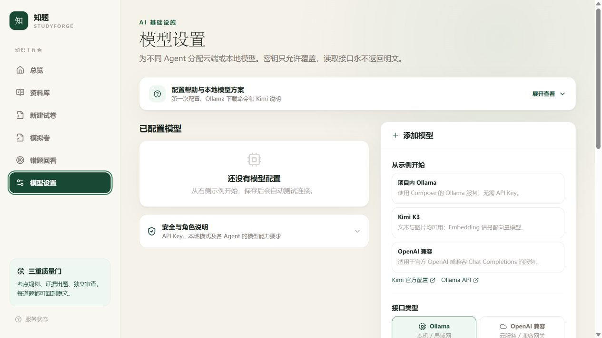
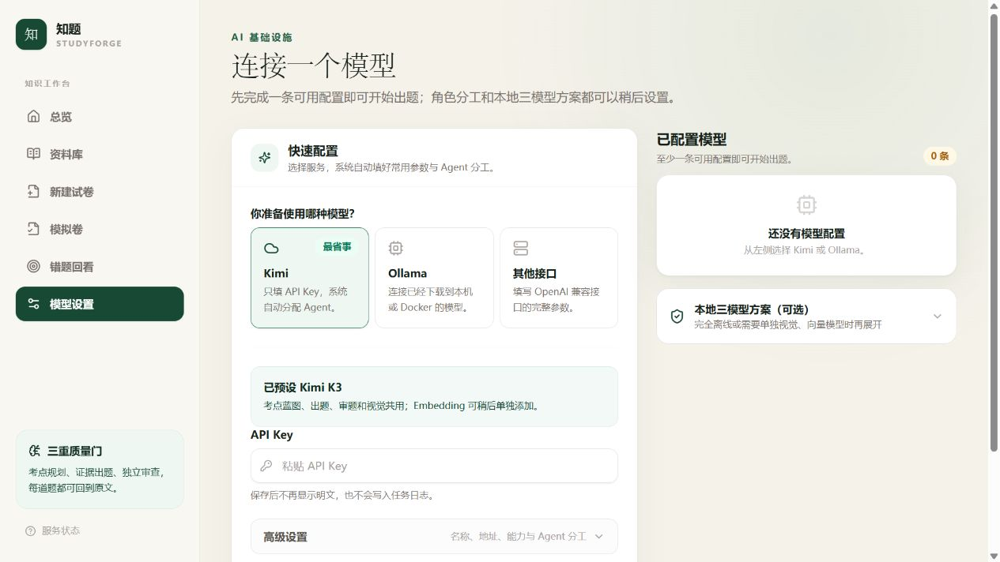
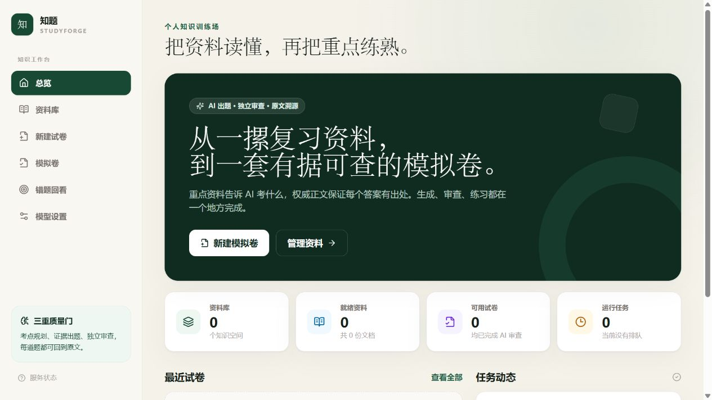
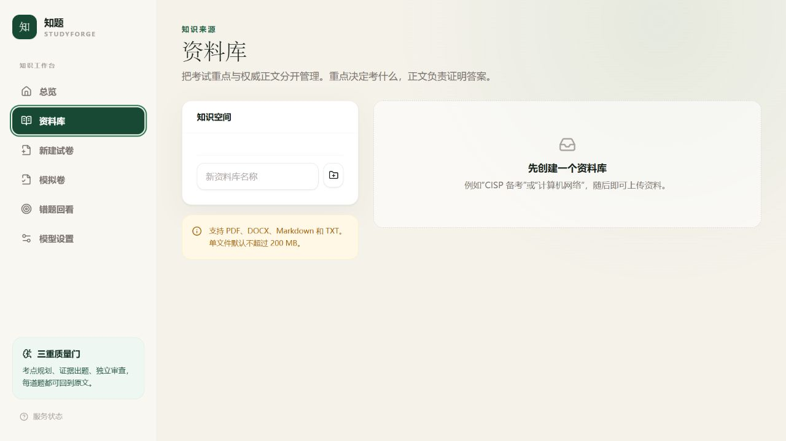
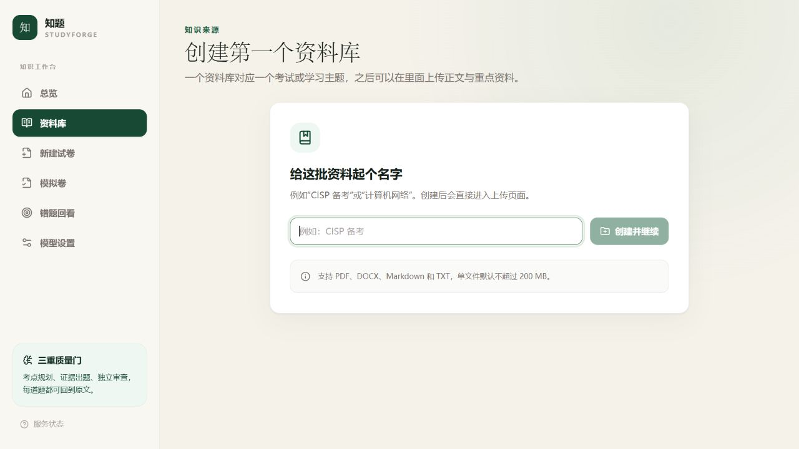
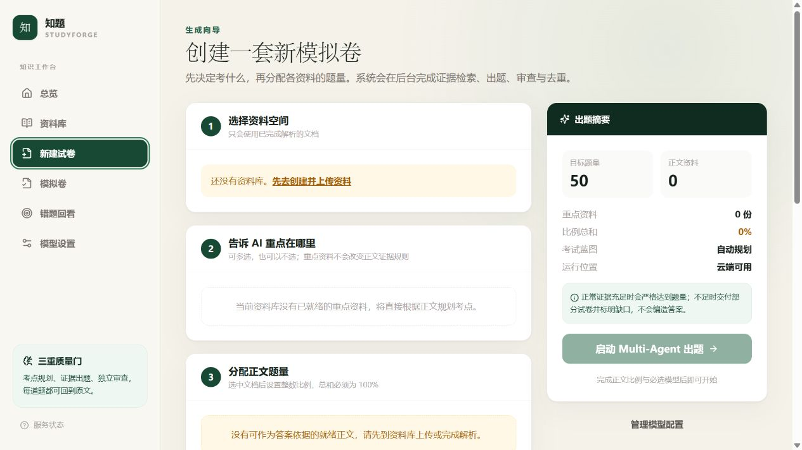
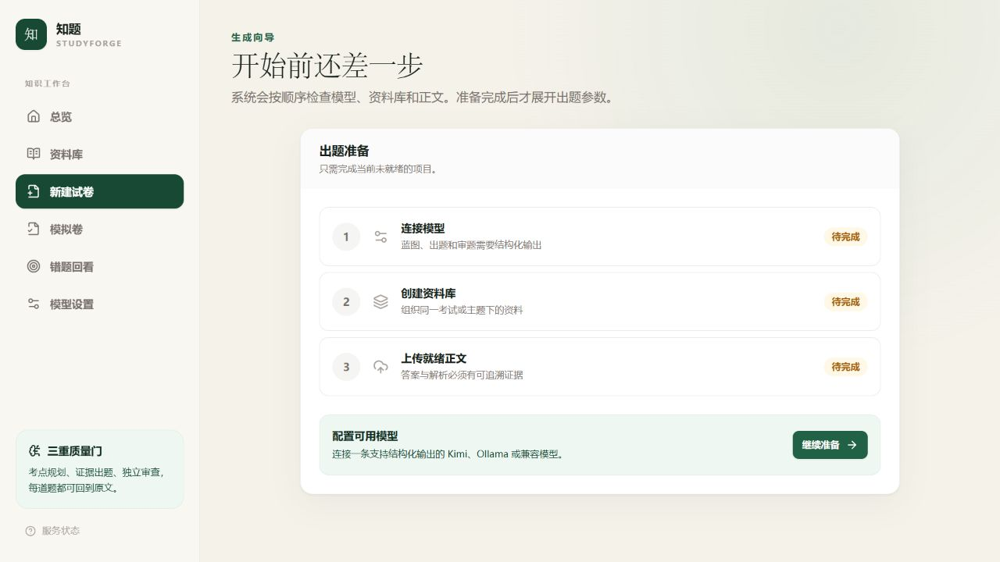

# 首次使用流程简化审计

## 审计目标

本次审计聚焦空白环境下的首次使用路径，重点检查模型配置是否容易理解，以及首页、资料库、出卷页是否会把用户带到当前真正可执行的下一步。

审计环境：`http://localhost:3000`，单用户、数据库已完全重置，桌面视口约 1265 × 710。

## 核心结论

原流程把“新手必填项、专业参数、Agent 分工、本地模型下载说明”同时放在模型设置页，并在模型和资料尚未就绪时仍完整展示出卷表单。用户看到了很多控件，但无法判断先做什么。

优化后，首次使用路径收敛为：

1. 连接一个模型。
2. 创建资料库。
3. 上传并等待正文解析完成。
4. 进入出卷参数设置。

每个页面只突出当前可执行的一步；高级参数仍被保留，但默认折叠。

## 前后对比

### 1. 模型配置

优化前：示例、接口类型、配置名称、地址、模型名、能力、五个 Agent 角色和本地方案同时出现，首屏无法完成一次配置。

优化后：先选 Kimi、Ollama 或其他兼容接口。Kimi 默认只要求 API Key；Ollama 默认只要求运行位置和 `ollama list` 中的模型名。名称、Base URL、能力与 Agent 分工进入“高级设置”。本地三模型方案也改为按需展开。

### 2. 首页下一步

优化前：首页无论环境是否就绪，都以“新建模拟卷”为主操作。

优化后：首页根据模型、资料库和就绪正文状态动态决定主操作，并显示三步准备进度。

### 3. 资料库空状态

优化前：空白环境仍显示侧栏和大面积空内容区，创建入口不突出。

优化后：首屏只保留资料库命名和“创建并继续”，创建后再展开上传与文档管理。

### 4. 出卷前置条件

优化前：模型、资料库和正文都不存在时，仍展示完整五步表单与不可用的出题按钮。

优化后：只显示模型、资料库、正文三项准备状态，并把唯一主按钮指向第一项缺失条件。准备完成后才显示完整出卷向导；模型分工、运行位置和随机种子默认收进“高级设置”。

## 验证步骤

| 步骤 | 检查内容 | 结果 |
| --- | --- | --- |
| 1 | 空白首页主按钮是否指向模型配置 | 通过，跳转到 `/settings` |
| 2 | Kimi 是否只暴露必要的 API Key | 通过，其他参数默认折叠 |
| 3 | 切换 Ollama 是否自动带出本地地址和 `qwen3:8b` | 通过 |
| 4 | 资料库名称填写后按钮是否可用 | 通过 |
| 5 | 空白出卷页是否隐藏完整表单 | 通过，只显示准备清单 |
| 6 | 出卷准备页是否跳转到第一项缺失条件 | 通过，跳转到 `/settings` |
| 7 | 浏览器控制台是否出现错误 | 通过，未发现错误 |
| 8 | 前端生产构建与单元测试 | 通过，构建成功，11 项测试通过 |

## 证据边界

本次验证覆盖完全重置后的空白环境与关键导航交互，没有录入真实 API Key，也没有创建本地运行数据。因此“模型连接成功、上传解析完成、生成整套试卷”的业务链路不属于本次审计范围；它们应在用户配置真实模型和资料后继续进行端到端验证。
